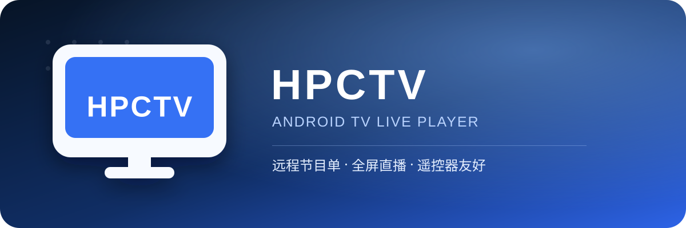
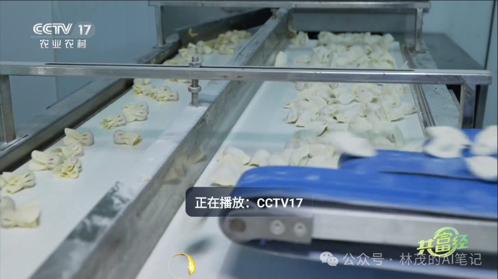
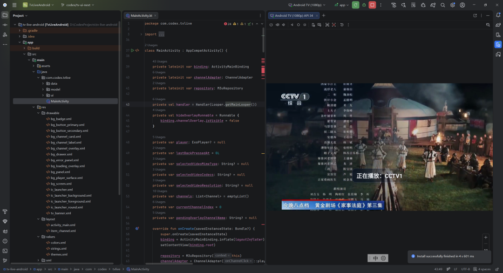

<div align="center">
  

  <br />

  <a href="https://developer.android.com/tv"></a>
  
  
  
  

  <p><strong>一个简洁、遥控器友好的 Android TV 直播播放器。</strong></p>
  <p>支持远程 HTTP M3U 节目单，服务器更新后重新打开 App 即可获取最新频道。</p>

  <p>
    <a href="#-快速开始">快速开始</a> ·
    <a href="#-节目单配置">节目单配置</a> ·
    <a href="#-遥控器操作">遥控器操作</a> ·
    <a href="#-打包-apk">打包 APK</a> ·
    <a href="UserGuide.md">使用说明</a>
  </p>
</div>

---

## ✨ 核心特性

| 功能       | 说明 |
|----------| --- |
| 📺 全屏直播  | 基于 Media3 ExoPlayer 播放 HLS / M3U8 视频 |
| ☁️ 远程节目单 | 通过 HTTP 或 HTTPS 加载服务器上的 M3U 文件 |
| 🔙 自动回退  | 远程节目单不可用时自动读取本地 `channels.m3u` |
| 🎮 遥控器适配 | 支持方向键切台、OK 键选台、返回键关闭抽屉 |
| ⚡ 切台反馈   | 切换频道时显示加载遮罩，画面就绪后自动消失 |
| 🏷️ 播放提示 | 成功播放后显示 5 秒“正在播放：频道名” |
| 🧭 频道抽屉  | 按 OK 键从左侧弹出半透明频道列表 |
| 🛡️ 防误退出 | 主播放页需连续按两次返回键才会退出 |

## 🎮 遥控器操作

| 按键 | 播放界面 | 频道列表打开时 |
| --- | --- | --- |
| `↑` | 切换到上一个频道 | 向上选择频道 |
| `↓` | 切换到下一个频道 | 向下选择频道 |
| `OK / 确认` | 打开频道列表 | 播放当前频道并关闭列表 |
| `返回` | 连按两次退出 App | 关闭频道列表，不退出 App |

## 🚀 快速开始

### 环境要求

- Android Studio 最新稳定版
- JDK 17（推荐使用 Android Studio 自带 JDK）
- Android SDK 34 或 35
- Android TV 模拟器或 Android TV / 电视盒子真机

### 运行项目

1. 使用 Android Studio 打开项目根目录。
2. 等待 Gradle 同步完成。
3. 在 `Settings > Build Tools > Gradle` 中确认 `Gradle JDK` 为 JDK 17。
4. 启动 Android TV 模拟器，或连接已开启调试的真机。
5. 顶部运行配置选择 `app`，然后点击 `Run`。

> [!TIP]
> 模拟器建议选择 `TV > Android TV (1080p)`，系统镜像建议使用 Android 13 或更高版本。

## ☁️ 节目单配置

HPCTV 支持“远程优先、本地兜底”的节目单加载方式。

```text
App 启动
   └─ 读取 playlist_config.properties
       ├─ 配置了远程地址 → 下载远程 M3U
       │   ├─ 成功 → 使用远程频道
       │   └─ 失败 → 回退到本地 channels.m3u
       └─ 地址为空 → 使用本地 channels.m3u
```

### 推荐：远程 HTTP M3U

编辑配置文件：

[`app/src/main/assets/playlist_config.properties`](app/src/main/assets/playlist_config.properties)

```properties
remote_playlist_url=https://your-domain.com/channels.m3u
```

以后只需更新服务器上的 `channels.m3u`。App 每次启动都会优先读取远程节目单，无需修改 Kotlin 代码。

> [!IMPORTANT]
> `assets` 中的配置会被打包进 APK。更换服务器地址后仍需重新打包；只更新服务器上同一个地址对应的 M3U 内容，则不需要重新打包。

### 本地 M3U

本地节目单位于：

[`app/src/main/assets/channels.m3u`](app/src/main/assets/channels.m3u)

不使用远程节目单时，将配置保持为空：

```properties
remote_playlist_url=
```

### M3U 示例

```m3u
#EXTM3U
#EXTINF:-1 group-title="央视",CCTV1
https://your-domain.com/live/cctv1.m3u8
#EXTINF:-1 group-title="央视",CCTV2
https://your-domain.com/live/cctv2.m3u8
```

## 📦 打包 APK

### Debug 测试包

在 Android Studio 中选择：

```text
Build > Generate App Bundles or APKs > Generate APKs
```

默认输出位置：

```text
app/build/outputs/apk/debug/app-debug.apk
```

### Release 正式包

在 Android Studio 中选择：

```text
Build > Generate Signed App Bundle or APK...
```

1. 选择 `APK`。
2. 创建或选择签名文件 `.jks`。
3. 选择 `release` 构建类型。
4. 勾选 `V1` 和 `V2` 签名。
5. 点击 `Create` 完成打包。

默认输出位置：

```text
app/build/outputs/apk/release/app-release.apk
```

> [!WARNING]
> 请妥善保存签名文件和密码。签名丢失后，将无法用同一身份为已安装版本提供升级包。

## 🧱 项目结构

```text
tv-live-android/
├─ app/src/main/
│  ├─ assets/
│  │  ├─ channels.m3u                 # 本地节目单
│  │  └─ playlist_config.properties   # 远程节目单地址
│  ├─ java/com/codex/tvlive/
│  │  ├─ MainActivity.kt              # 播放与遥控器交互
│  │  ├─ data/M3uRepository.kt        # 远程/本地 M3U 读取与解析
│  │  └─ ui/ChannelAdapter.kt         # 频道列表
│  └─ res/
│     ├─ layout/                       # TV 界面布局
│     └─ drawable/                     # 图标、横幅与背景资源
├─ UserGuide.md                        # 简明使用说明
└─ README.md
```

## 🛠️ 修改应用信息

| 内容 | 修改位置 |
| --- | --- |
| 应用名称 | `app/src/main/res/values/strings.xml` 中的 `app_name` |
| 用户可见版本 | `app/build.gradle.kts` 中的 `versionName` |
| 内部版本号 | `app/build.gradle.kts` 中的 `versionCode` |
| 方形图标 | `app/src/main/res/drawable/ic_launcher.xml` |
| 圆形图标 | `app/src/main/res/drawable/ic_launcher_round.xml` |
| TV 横幅 | `app/src/main/res/drawable/tv_banner.xml` |

## ⚠️ 使用说明

- 直播源可能受网络、地区、鉴权、编码和服务状态影响。
- “只有声音、画面花屏”通常意味着源的码流异常或设备解码兼容性不足。
- 请仅使用你有权访问和分发的直播源，并遵守当地法律及内容版权要求。

---
## 运行效果图
<div align="center">
<br/>
<br/>
<br/>
<br/>
<br/>
<br/>
<br/>
<br/>

</div>
